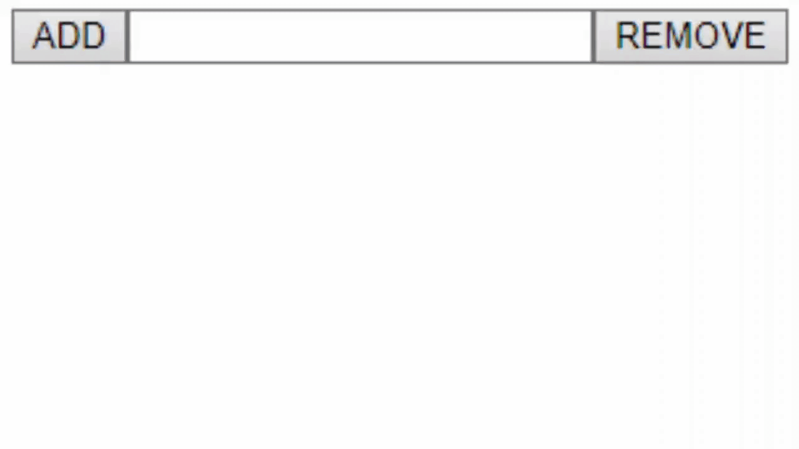

# Simple React JS Redux example
**Note: functional component + Redux**



## Table of contents
* [Store](#store)
* [Action](#action)
* [Reducer](#reducer)
* [Use in component](#Use-in-component)

## How to run this example?
Just pull and run command:
```
npm install
```

## Store
Just one object that is the source of truth
```
import { createStore } from "redux";
import reducer from "../reducers/reducer";

const store = createStore(reducer);

export default store;
```

## Action
Here you just describe WHAT are you storing.

### Types
This is your bank of constants for all possible actions
```
export const BUG_ADDED = "bugAdded";
export const BUG_REMOVED = "bugRemoved";
export const BUG_RESOLVED = "bugResolved";
```

### Actions
Describe what would you like to store
```
export const bugAdded = (description) => ({

   type: actions.BUG_ADDED,
   payload: {
     description,
   },
   
});
```

## Reducer
This is the place where you actually edit store state
```
import * as actions from "../actions/actionTypes";

export default function reducer(state = [], action) {

switch (action.type) {

   case actions.BUG_ADDED:
     return state; // Edited in some way
   case actions.BUG_REMOVED:
     return state; // Edited in some way
   case actions.BUG_RESOLVED:
     return state; // Edited in some way
   default:
     return state; // return clean state just in case
}
```

## Use in component
First import STORE and ACTIONS
```
import * as actions from "../actions/actions";
import store from "../store/store";

// Ask store to edit data
store.dispatch(actions.bugAdded(bugDescription));

// Ask store for current data
store.getState()
```
